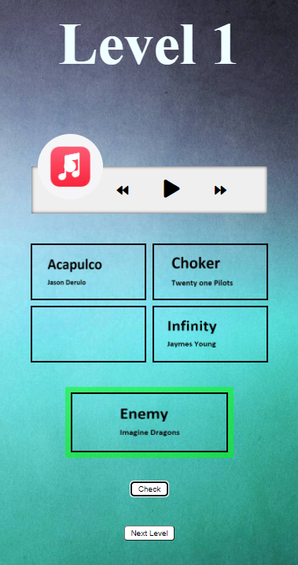
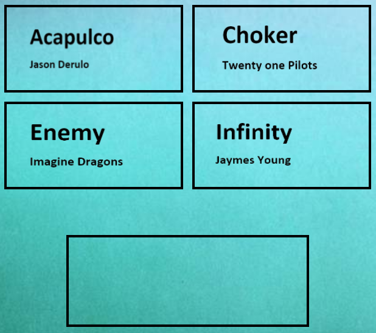
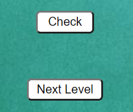

# MusicGuesser CodeWeek

## Project Description:

This Project is a small Music Quiz wich works with mp3 Music Files and a Music Player. Questions in this quiz get Anwsered via the Drag and Drop API and a green/red Border we used this API because we thought its something you dont see everyday and it would be kind of cool with the way it looks/works.

## Used API

[Drag and Drop API](https://developer.mozilla.org/en-US/docs/Web/API/HTML_Drag_and_Drop_API)

## How to Use:

Startup the index.html file to get to the main Website. After that youll see a "test music box". If you want to, you are able to listen to some music from that "box".

If you look at the top right corner, there is a navbar with Home/Music Game. Press on Music Game and start the Guessing!

## How does it work:

This Project is Built with Vanilla JS and the Drag and Drop API. 

We used a mp3 songs that get played via the Music Player. With the Drag and Drop API you now are able to Take one of the 4 Awnsers in the Boxes and then Drop it in the Awnser Field.

With the Check Button it will tell you if the Awnser is true or false and with the Next Site Button you will get an alert if you wanna go to the next Question.

### Made Within the Winter CodeWeek
By Mikka, Marzio and Simon
